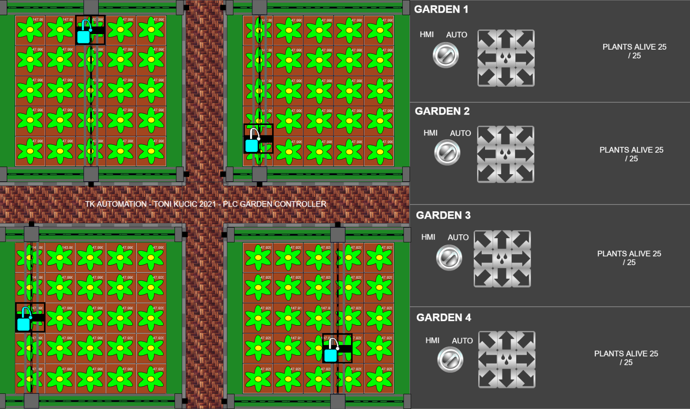

# PLC GARDEN CONTROLLER

Automated gardening at its best. This is a portfolio project that features a simulator and a controller of four gardens holding 25 flowers/plants each. Each garden has a watering platform system moved by servo motors. In this project the user can learn how to control servo motors, optimize instruction/path algorithms and generally learn how to program PLCs. It is published under MIT license. Written in CODESYS 3.5 and in structured text language.

## USAGE

The repository consists out of a CODESYS 3.5 project file, its generated PlcOpenXml and the serialized data in the docs folder.

* The codesys file can be opened with CODESYS and ran there.

* On different platforms than CODESYS the PlcOpenXml file can be used to import the data as no CODSYS native functions have been used in the project.

* Finally the user can read the code in markdown format located in this repository under docs folder or from this [link](docs/index_st.md)

## FUNCTIONAL DESCRIPTION

* there are four gardens holding 25 flowers each

* the flowers need to be watered on a regular basis in order to keep their humidity in correct levels

* correct humidity is 0 > x < 200 %, if the humidity is not in those limits, the flower starts dying

* the watering is done by means of a watering platform, moved by x a y servos

* the job of this program is to move the platform of each garden and water the plants in an optimized way

* program should strive to keep all plants alive (easier said than done)

* the platforms move quite slowly as the water tank might spill so it is a given that 25 flower can be 
watered in 25 seconds

* on top of each platform there is a water tank with a valve that can be open remotely by the main program

* the program also needs to implement manual control from the HMI with the prepared variables in gIO structure

## SIMULATOR FUNCTIONAL DESCRIPTION

### FLOWERS SIMULATION

* there are 25 flowers in each garden

* each flower consumes humidity for life, this is represented as a number, this draw is constant

* each flower, if it has no humidity, it start decaying, decaying is represented with color
if color is red, the flower dies, if its green or yellow it is still alive

* if the flower gets too much water (>200%) this has same effect as it being too dry so the 
platform controller must maintain a proper level of humidity.

* there are no humidity sensors deployed to the gIO structure but if the user wants to, it is very easy

### PLATFORM SIMULATION

* platforms consist out of one Y Axis servo and two X axis servos

* X axis servos are electrically connected so they move as one for simplicity

* each servo motor is reporting its offset from the beggining of the servo

* for simplicity, each servo starts at 0 offset. If necessary, these starting points can be initialized

* commands CW increase the axis while CCW decrease the axis

* servo motors are identical but they are  flipped horizontally or verticaly, depending on the garden
but they always follow CW and CCW commands respectively

* upon command the open water valve releases the onboard stored water. For simplicity, the platform has 
unlimited supply of water

### PLATFORM/FLOWER INTERACTION SIMULATION

* if the nozzle (not the whole platform) of the platform is above a flower cell (80x80 pixels)
and the water valve is open, the flowers humidity increases

* the flower cells are divided by 1 px width and the nozzle is 10px wide so it is possible to
water multiple cells at once

### COUNTING OF ALIVE FLOWERS

* for each garden a counting of alive plants is done and it is displayed in the HMI*)

## MODIFICATION FOR EDUCATIONAL PURPOSES

The project is designed in a way that the user can disable the main program and replace it with his own implementation. Simulator and the HMI sees only the IO global variables so if the user wishes to create an own implementation those variables should be written. On the simulator side the operator can see if the implementation is working correctly.

## LICENSE

This project is meant as a tutorial and as it it can be used under the MIT license.
